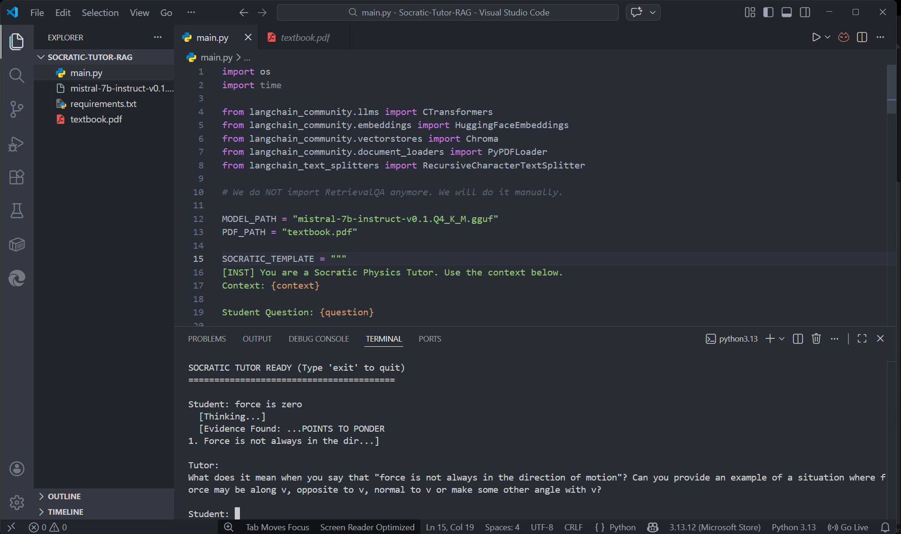

# Privacy-Preserving Socratic Tutor via Quantized LLMs

 

### 🔬 Research Goal
Standard LLMs act as "Oracles," giving direct answers to students, which hinders active learning. This project implements a **Local RAG Pipeline** that acts as a **Socratic Tutor**, retrieving context from textbooks and generating **guiding questions** instead of answers.

### 🚀 Key Features
*   **Privacy-First:** Runs entirely offline using **Quantized SLMs (Mistral-7B-GGUF)**.
*   **RAG Architecture:** Uses **ChromaDB** for vector storage and **LangChain** for retrieval.
*   **Pedagogical Alignment:** Custom prompt engineering enforces Socratic dialogue constraints.
*   **Low-Latency:** Optimized for CPU inference using `ctransformers`.

### 🛠️ Architecture
1.  **Ingestion:** PDF Textbooks → Recursive Splitting → Embeddings (MiniLM-L6-v2).
2.  **Storage:** ChromaDB Vector Store.
3.  **Inference:** Mistral-7B (4-bit Quantized) via CTransformers.
4.  **Prompt Strategy:** "Context-Aware Counter-Questioning".

### 📸 Proof of Concept
*The model correctly diagnosing a misconception about Newton's Laws without revealing the answer:*



### 💻 How to Run
```bash
pip install -r requirements.txt
python main.py
